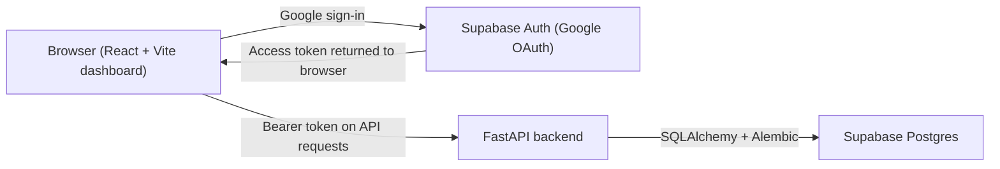
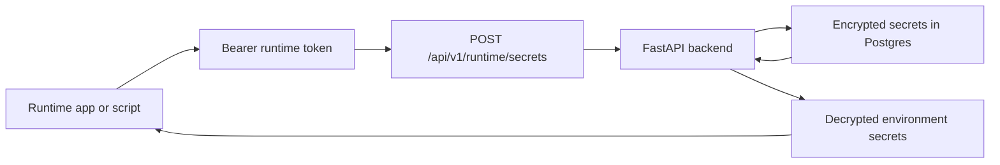

# EnvBasis User and Operator Guide

EnvBasis lets you store project secrets, separate them by environment, and fetch them at runtime using project-scoped tokens.

This repository contains the shipped EnvBasis dashboard and API: a React/Vite frontend for users and operators, plus a FastAPI backend backed by Supabase Postgres.

This README now serves two audiences:

- Product users who want to know how to upload secrets, create runtime tokens, and use those tokens inside apps or AI agents
- Operators who need to run, configure, debug, or extend this repository

It deliberately ignores the `plan.md` files and treats the checked-in code and config as the only source of truth.

## What's Here

- `frontend/`: React 19 + Vite dashboard
- `backend/`: FastAPI API, SQLAlchemy models, Alembic migrations, auth verification, secret encryption, runtime token handling
- Supabase integration for:
  - Google sign-in in the browser
  - Postgres as the application database
  - JWT verification inputs for backend auth

## What's Not Here

- No bundled CLI implementation, SDK package, or deployable runtime client
- No Docker, Compose, Terraform, or infrastructure-as-code in this repo
- No local Postgres development path; the backend rejects localhost database URLs
- No email/password auth flow in the shipped frontend; login and signup both use Google OAuth
- No environment rename/delete endpoints
- No advanced RBAC beyond owner/member plus a per-member secret access flag

CLI commands shown in some UI surfaces are product copy only. They are not implemented in this repository.

## Start Here If You're Using EnvBasis

If you are using EnvBasis as a product, the normal flow is:

1. Sign in with Google
2. Create a project
3. Create one or more environments such as `dev`, `staging`, or `prod`
4. Upload secrets from the Secrets page or through the API
5. Create a runtime token for the environment your app or AI agent will run in
6. Put that runtime token in your server-side deployment environment
7. At startup, your app or agent calls EnvBasis to fetch secrets and then uses them in memory

The important idea is simple:

- You do not put your raw API keys directly into your app build
- You put one EnvBasis runtime token into the deployment environment
- Your app uses that runtime token to fetch the actual secrets it needs

### Common Product Use Cases

- AI agents that need `OPENAI_API_KEY`, `ANTHROPIC_API_KEY`, `GOOGLE_API_KEY`, or model routing settings
- Backend apps that need database URLs, Redis credentials, webhook secrets, and third-party API keys
- Small teams that want one place to manage `dev`, `staging`, and `prod` secrets without sending `.env` files around

### Fastest End-User Flow

1. Open the dashboard and sign in with Google.
2. Create a project, for example `support-agent`.
3. Create an environment, for example `prod`.
4. Open the Secrets page and either:
   - click `Add Secret` to add one value at a time, or
   - click `Upload .env` to bulk import a `.env` file
5. Open `Runtime Tokens`, create a token for `prod`, and copy the plaintext token.
6. Put that runtime token into your AI agent's server environment.
7. At startup, your agent makes one request to `POST /api/v1/runtime/secrets` and loads the returned secrets into memory.

## How To Upload Secrets

### Option 1: Upload From the Dashboard

This is the simplest flow for most users.

#### Add one secret manually

1. Open your project
2. Go to `Secrets`
3. Click `Add Secret`
4. Choose the target environment
5. Enter a key such as `OPENAI_API_KEY`
6. Enter the value
7. Save

#### Import a whole `.env` file

1. Open your project
2. Go to `Secrets`
3. Click `Upload .env`
4. Choose the environment
5. Upload a file or paste `.env` contents
6. Click `Import Secrets`

The shipped dashboard parser:

- accepts `KEY=VALUE`
- accepts `export KEY=VALUE`
- ignores blank lines and comments
- supports quoted values
- keeps the last value if a key appears multiple times

Example `.env` input:

```dotenv
OPENAI_API_KEY=sk-...
ANTHROPIC_API_KEY=...
DATABASE_URL=postgres://...
MODEL_NAME=gpt-5
```

### Option 2: Upload Through the API

Use this if you are automating setup from your own backend, script, or internal tooling.

These examples assume:

- `API_BASE_URL` includes the API prefix, for example `https://api.yourdomain.com/api/v1`
- `USER_ACCESS_TOKEN` is a valid signed-in bearer token for a project owner or for a member with secret push/pull access
- `PROJECT_ID` and `ENVIRONMENT_ID` already exist

#### Discover project and environment IDs

```bash
curl -H "Authorization: Bearer $USER_ACCESS_TOKEN" \
  "$API_BASE_URL/projects"

curl -H "Authorization: Bearer $USER_ACCESS_TOKEN" \
  "$API_BASE_URL/projects/$PROJECT_ID/environments"
```

#### Create one secret

```bash
curl -X POST \
  -H "Authorization: Bearer $USER_ACCESS_TOKEN" \
  -H "Content-Type: application/json" \
  "$API_BASE_URL/projects/$PROJECT_ID/environments/$ENVIRONMENT_ID/secrets" \
  -d '{
    "key": "OPENAI_API_KEY",
    "value": "sk-..."
  }'
```

#### Bulk upload many secrets at once

```bash
curl -X POST \
  -H "Authorization: Bearer $USER_ACCESS_TOKEN" \
  -H "Content-Type: application/json" \
  "$API_BASE_URL/projects/$PROJECT_ID/environments/$ENVIRONMENT_ID/secrets/push" \
  -d '{
    "secrets": {
      "OPENAI_API_KEY": "sk-...",
      "ANTHROPIC_API_KEY": "...",
      "DATABASE_URL": "postgres://...",
      "MODEL_NAME": "gpt-5"
    }
  }'
```

## How To Create and Use a Runtime Token

Runtime tokens are the bridge between EnvBasis and your running app.

Use them when:

- your AI agent starts on a server or VM
- your backend service boots in Docker, Kubernetes, Railway, Render, Fly.io, or a VPS
- you want the app to fetch secrets at runtime instead of hard-coding them into deployment config

### Create a Runtime Token From the Dashboard

1. Open your project
2. Go to `Runtime Tokens`
3. Click `Create Token`
4. Choose the environment the app should read from
5. Give the token a name such as `support-agent-prod`
6. Optionally set an expiry
7. Copy the plaintext token

Important:

- Treat the runtime token like a password
- Put it only in server-side environments, not browser code
- Create separate tokens for separate apps or environments when possible

### Create a Runtime Token Through the API

Only project owners can create tokens.

```bash
curl -X POST \
  -H "Authorization: Bearer $USER_ACCESS_TOKEN" \
  -H "Content-Type: application/json" \
  "$API_BASE_URL/projects/$PROJECT_ID/environments/$ENVIRONMENT_ID/runtime-tokens" \
  -d '{
    "name": "support-agent-prod",
    "expires_at": "2026-12-31T23:59:59Z"
  }'
```

The response includes a `plaintext_token`. Copy it immediately and store it in your deployment environment.

### Put the Runtime Token in Your Agent Environment

Your own app can name these environment variables however you want. In the examples below, we use:

- `ENVBASIS_API_URL`
- `ENVBASIS_RUNTIME_TOKEN`

Example:

```bash
export ENVBASIS_API_URL="https://api.yourdomain.com/api/v1"
export ENVBASIS_RUNTIME_TOKEN="envb_rt_..."
```

### Fetch Secrets at Runtime

Your app or AI agent should call the runtime endpoint from the server side:

```bash
curl -X POST \
  -H "Authorization: Bearer $ENVBASIS_RUNTIME_TOKEN" \
  "$ENVBASIS_API_URL/runtime/secrets"
```

Example response:

```json
{
  "project_id": "uuid",
  "environment_id": "uuid",
  "secrets": {
    "OPENAI_API_KEY": "sk-...",
    "MODEL_NAME": "gpt-5"
  },
  "generated_at": "2026-03-17T12:00:00Z"
}
```

## AI Agent Examples

The pattern is:

1. store only the EnvBasis runtime token in your deployment environment
2. fetch secrets at process startup
3. load returned secrets into memory
4. initialize your AI client using those fetched secrets

These are usage examples, not files from this repository. Install the SDKs you actually use in your own agent project.

### Python Example

This example fetches secrets from EnvBasis, places them into `os.environ`, and then initializes an OpenAI client.

```python
import os
import requests
from openai import OpenAI


def load_envbasis_secrets() -> dict[str, str]:
    api_base = os.environ["ENVBASIS_API_URL"].rstrip("/")
    runtime_token = os.environ["ENVBASIS_RUNTIME_TOKEN"]

    response = requests.post(
        f"{api_base}/runtime/secrets",
        headers={"Authorization": f"Bearer {runtime_token}"},
        timeout=10,
    )
    response.raise_for_status()

    payload = response.json()
    secrets = payload["secrets"]
    os.environ.update(secrets)
    return secrets


def main() -> None:
    secrets = load_envbasis_secrets()

    client = OpenAI(api_key=secrets["OPENAI_API_KEY"])

    response = client.responses.create(
        model=secrets.get("MODEL_NAME", "gpt-5"),
        input="Say hello in one sentence.",
    )

    print(response.output_text)


if __name__ == "__main__":
    main()
```

### Node.js Example

```js
import OpenAI from 'openai';

async function loadEnvBasisSecrets() {
  const apiBase = process.env.ENVBASIS_API_URL.replace(/\/+$/, '');
  const runtimeToken = process.env.ENVBASIS_RUNTIME_TOKEN;

  const response = await fetch(`${apiBase}/runtime/secrets`, {
    method: 'POST',
    headers: {
      Authorization: `Bearer ${runtimeToken}`,
    },
  });

  if (!response.ok) {
    throw new Error(`EnvBasis secret fetch failed: ${response.status}`);
  }

  const payload = await response.json();
  Object.assign(process.env, payload.secrets);
  return payload.secrets;
}

async function main() {
  const secrets = await loadEnvBasisSecrets();

  const client = new OpenAI({
    apiKey: secrets.OPENAI_API_KEY,
  });

  const response = await client.responses.create({
    model: secrets.MODEL_NAME || 'gpt-5',
    input: 'Say hello in one sentence.',
  });

  console.log(response.output_text);
}

main().catch((error) => {
  console.error(error);
  process.exit(1);
});
```

### Minimal Generic Pattern for Any AI Stack

Even if you are not using OpenAI, the pattern stays the same:

1. fetch secrets from EnvBasis using the runtime token
2. read keys such as `OPENAI_API_KEY`, `ANTHROPIC_API_KEY`, `GOOGLE_API_KEY`, `DATABASE_URL`, or `REDIS_URL`
3. initialize your model clients, vector database clients, and storage clients from those fetched values

### Recommended Runtime-Token Safety Rules

- Never put the runtime token into frontend or browser code
- Never commit the runtime token to Git
- Do not log the token or include it in error messages
- Use separate tokens per environment and per deployed service when possible
- Rotate or revoke tokens if a host or deployment secret store is compromised

## If You Are Self-Hosting or Running This Repo Locally

### Fast Local Start

### 1. Backend

Run these commands from the repo root:

```bash
cd backend
python3 -m venv .venv
source .venv/bin/activate
pip install -r requirements-dev.txt
```

Create `backend/.env` with values matching the tables below. A minimal local example:

```dotenv
APP_ENV=development
DEBUG=true
API_V1_PREFIX=/api/v1
DATABASE_URL=postgresql+psycopg://postgres:<password>@db.<project-ref>.supabase.co:5432/postgres?sslmode=require
SUPABASE_URL=https://<project-ref>.supabase.co
SUPABASE_JWT_SECRET=<your-supabase-jwt-secret>
SUPABASE_JWT_AUDIENCE=authenticated
SECRETS_MASTER_KEY=<your-fernet-key>
CORS_ALLOWED_ORIGINS=http://localhost:5173
```

Generate a valid Fernet key after installing backend dependencies:

```bash
python3 -c "from cryptography.fernet import Fernet; print(Fernet.generate_key().decode())"
```

Apply migrations and start the API:

```bash
alembic upgrade head
uvicorn app.main:app --reload
```

The backend will be available at `http://localhost:8000` by default.

### 2. Frontend

In a second terminal:

```bash
cd frontend
cp .env.example .env
npm install
npm run dev
```

Update `frontend/.env` if needed:

```dotenv
VITE_SUPABASE_URL=https://<project-ref>.supabase.co
VITE_SUPABASE_ANON_KEY=<your-supabase-anon-key>
VITE_API_BASE_URL=http://localhost:8000/api/v1
```

The frontend runs at `http://localhost:5173` by default.

### 3. Verify the stack

Check the backend health endpoint:

```bash
curl http://localhost:8000/api/v1/health
```

Expected response shape:

```json
{"service":"EnvBasis API","environment":"development","status":"ok"}
```

Then open `http://localhost:5173`, sign in with Google, and confirm that the Projects page loads.

## Architecture

### System Overview



### Runtime Secret Fetch Flow



## Repo Map

| Path | Purpose |
| --- | --- |
| `backend/app/main.py` | FastAPI app factory, middleware wiring, API router, startup audit cleanup |
| `backend/app/core/config.py` | All runtime settings and defaults |
| `backend/app/core/security.py` | Supabase JWT decoding and auth identity building |
| `backend/app/core/middleware.py` | Request IDs, response headers, in-memory rate limiting |
| `backend/app/api/routes/` | Auth, projects, secrets, runtime tokens, runtime fetch, health endpoints |
| `backend/app/models/` | SQLAlchemy models for projects, environments, members, secrets, tokens, token shares, audit logs |
| `backend/app/services/` | Encryption, runtime token generation, secret validation, audit helpers |
| `backend/alembic/` | Alembic config and migrations |
| `backend/alembic/versions/` | Schema history: initial schema, token sharing, member secret access, project descriptions, secret tombstones, active token name uniqueness |
| `frontend/src/App.jsx` | Router and top-level route tree |
| `frontend/src/auth/` | Auth context, redirects, Supabase-backed session handling |
| `frontend/src/lib/api.js` | Frontend HTTP client for every shipped backend route |
| `frontend/src/pages/` | Projects, Overview, Secrets, Environments, Team, Tokens, Audit Logs, Settings, Login, Signup |
| `frontend/src/layouts/ProjectLayout.jsx` | Project shell, project/env loading, top-bar environment switching |

## Configuration

### Frontend Environment Variables

| Variable | Required | Default | Notes |
| --- | --- | --- | --- |
| `VITE_SUPABASE_URL` | Yes | None | Supabase project URL used by the browser for OAuth session handling |
| `VITE_SUPABASE_ANON_KEY` | Yes | None | Public anon key for browser auth |
| `VITE_API_BASE_URL` | Yes | None | Base URL for backend API requests. For local dev, keep `/api/v1` in the value |

### Backend Essentials

| Variable | Required | Default | Notes |
| --- | --- | --- | --- |
| `DATABASE_URL` | Yes | None | Must point to Supabase Postgres. Localhost and `127.0.0.1` are rejected in all environments |
| `SECRETS_MASTER_KEY` | Yes | None | Fernet key used to encrypt secret values and stored runtime tokens |
| `SUPABASE_JWT_SECRET` | Conditional | None | Required when `SUPABASE_JWT_ALGORITHM=HS256`, which is the default |
| `SUPABASE_URL` | Conditional | `None` | Required when `SUPABASE_JWT_ALGORITHM` is `RS256` or `ES256`; safe to set in all environments |
| `SUPABASE_JWT_AUDIENCE` | No | `authenticated` | Access token audience expected by the backend |
| `CORS_ALLOWED_ORIGINS` | Yes in production | Empty list | Comma-separated origins, for example `http://localhost:5173` |
| `APP_ENV` | No | `development` | Only `prod` and `production` trigger stricter production validation |
| `DEBUG` | No | `false` | Must be `false` in production |

### Backend Advanced and Defaulted Settings

| Variable | Default | Notes |
| --- | --- | --- |
| `APP_NAME` | `EnvBasis API` | FastAPI title and health/root response value |
| `API_V1_PREFIX` | `/api/v1` | Prefix applied to all API routers |
| `SQL_ECHO` | `false` | SQLAlchemy SQL logging |
| `SUPABASE_JWT_ALGORITHM` | `HS256` | Current code supports `HS256`, `ES256`, and `RS256` |
| `RUNTIME_TOKEN_PREFIX` | `envb_rt_` | Prefix used when generating runtime tokens |
| `RUNTIME_TOKEN_BYTES` | `32` | Passed to `secrets.token_urlsafe()` before prefixing |
| `RATE_LIMIT_AUTH_REQUESTS` | `120` | Requests per auth window |
| `RATE_LIMIT_AUTH_WINDOW_SECONDS` | `60` | Auth rate limit window |
| `RATE_LIMIT_SECRET_REQUESTS` | `300` | Requests per secret push/pull window |
| `RATE_LIMIT_SECRET_WINDOW_SECONDS` | `3600` | Secret push/pull rate limit window |
| `RATE_LIMIT_RUNTIME_REQUESTS` | `10000` | Requests per runtime window |
| `RATE_LIMIT_RUNTIME_WINDOW_SECONDS` | `3600` | Runtime rate limit window |
| `RATE_LIMIT_GENERAL_REQUESTS` | `1000` | Requests per general window |
| `RATE_LIMIT_GENERAL_WINDOW_SECONDS` | `3600` | General rate limit window |
| `AUDIT_LOG_RETENTION_DAYS` | `90` | Audit records older than this are deleted during cleanup |
| `AUDIT_LOG_CLEANUP_INTERVAL_SECONDS` | `86400` | Minimum interval between cleanup attempts |

### Setup Caveats That Matter

- The backend does not support a localhost database for development. Use Supabase Postgres even in local dev.
- The frontend only uses Supabase directly for Google sign-in. Product data still flows through the backend API.
- The frontend keeps auth in memory only. Refreshing the page clears the browser-side session.
- Users must authenticate once before an owner can invite them to a project or share a runtime token with them.
- `SECRETS_MASTER_KEY` must be a real Fernet key, not an arbitrary string.
- If you switch `SUPABASE_JWT_ALGORITHM` to `RS256` or `ES256`, `SUPABASE_URL` becomes operationally required for JWKS lookup.
- The frontend expects Supabase OAuth redirect handling at `/auth/callback`.

### Supabase OAuth Checklist

For local development, configure Supabase so Google sign-in can return to the frontend:

- Site URL: `http://localhost:5173`
- Redirect URL: `http://localhost:5173/auth/callback`
- Enable Google as an auth provider in Supabase

## First Successful Run Checklist

- `curl http://localhost:8000/api/v1/health` returns `status: ok`
- Visiting `http://localhost:5173` loads the login screen
- Google sign-in redirects back to `/auth/callback` and then into the app
- The Projects page loads without `Missing VITE_*` or auth configuration errors
- Creating a project succeeds and the project overview loads
- Creating an environment succeeds and it appears in the top-bar environment switcher

## Shipped Features

### Auth

- Google OAuth via Supabase from the frontend login and signup pages
- Backend bearer-token auth using Supabase JWT verification
- Automatic user record creation on the first authenticated backend request

### Projects

- Create, list, view, update, and delete projects
- Project cards show environment count, member count, runtime token count, and last activity

### Environments

- Owners can create environments inside a project
- Members can list environments they have access to
- Environment summary cards show active secret count plus last update/activity timestamps

### Secrets

- Manual create, edit, delete, reveal, and copy from the dashboard
- Bulk `.env` import using the push endpoint
- Plain-text `.env` export using the pull endpoint
- Secret counts and per-environment stats for project overview and environment pages

### Team Access

- Invite members by email
- Toggle per-member `can_push_pull_secrets`
- Revoke members, with shared-token safety checks

### Runtime Tokens and Sharing

- Owner-only runtime token creation
- Optional token expiry
- List tokens per project
- Share tokens with existing project members
- Reveal active tokens for owners and shared recipients
- Runtime fetch endpoint for applications using bearer runtime tokens

### Audit Logs

- Audit records for project, member, environment, secret, and runtime token actions
- Owner-only audit log UI and backend route

### Project Settings

- Rename a project
- Update project description
- Delete a project

## Operator Walkthroughs

### 1. Sign in and provision the user record

1. Open the frontend and sign in with Google.
2. The frontend exchanges OAuth state with Supabase and then calls `GET /api/v1/auth/me`.
3. If the user does not already exist in the backend database, the backend creates a `users` row automatically.

This first authenticated backend request is what makes later invite/share actions possible.

### 2. Create a project and environments

1. From the Projects page, create a new project with a name and optional description.
2. Open the project.
3. Create one or more environments from the Environments page, such as `dev`, `staging`, or `prod`.
4. Use the top bar to scope the dashboard to `all` environments or a single environment.

Current shipped environment operations are create and list only. There is no rename or delete flow in the API.

### 3. Add, edit, import, export, and delete secrets

From the Secrets page:

- Add a single secret manually
- Edit an existing secret value
- Delete a secret, which creates a tombstone version in the backend
- Reveal or copy a value in the UI
- Upload a `.env` file or paste `.env` contents
- Download a generated `.env` file for one environment

Important behavior:

- UI masking is presentation only. Authorized secret list requests return plaintext values over HTTPS.
- Manual secret entry uppercases the key in the UI.
- Bulk import parses `.env` style content, ignores comments, accepts `export KEY=VALUE`, handles quoted values, and uses the last value when duplicate keys appear.
- Secret mutations and bulk push/pull require owner access or `can_push_pull_secrets=true`.

### 4. Invite members and manage secret access

From the Team page, owners can:

- Invite an existing authenticated user by email
- Grant or remove secret push/pull access
- Revoke a member entirely

The invite call fails if the target email has not authenticated through the app at least once.

### 5. Revoke a member who has shared runtime tokens

This is one of the few admin flows with explicit safety checks.

When revoking a member:

- If they have no shared runtime tokens, revocation proceeds immediately.
- If they have shared runtime tokens, the backend returns a conflict unless the request includes `shared_token_action`.
- Allowed actions:
  - `keep_active`: remove the member and remove their share rows, but keep the underlying tokens active
  - `revoke_tokens`: remove the member, remove their share rows, and delete the underlying runtime tokens

Extra safeguard:

- If the member has already revealed any shared token, `keep_active` is rejected as unsafe.
- In that case the operator must choose `revoke_tokens` or rotate tokens separately before retrying.

### 6. Create, share, reveal, revoke, and use runtime tokens

From the Runtime Tokens page:

- Owners create tokens for one environment at a time
- Owners can share an active token with an existing project member
- Owners and shared recipients can reveal active tokens
- Owners can revoke tokens

Shipped behavior to know:

- Tokens are generated once, returned as plaintext on creation, then stored encrypted plus hashed in the backend.
- Non-owners only see tokens explicitly shared with them.
- Current revocation deletes the token record rather than soft-marking it as revoked.
- The backend also ships reveal-by-name and revoke-by-name endpoints even though the current frontend does not use them.

Example runtime fetch:

```bash
curl -X POST \
  -H "Authorization: Bearer <runtime-token>" \
  http://localhost:8000/api/v1/runtime/secrets
```

Expected response shape:

```json
{
  "project_id": "uuid",
  "environment_id": "uuid",
  "secrets": {
    "OPENAI_API_KEY": "..."
  },
  "generated_at": "timestamp"
}
```

### 7. Review audit logs

- Only project owners can view audit logs in the UI or call the audit-log endpoint.
- The overview page shows a small recent-activity sample for owners.
- The full Audit Logs page supports filtering by action and environment.

### 8. Update or delete a project

From Settings:

- Owners can rename the project
- Owners can update the description
- Owners can delete the project permanently

Project deletion cascades through related data because the SQLAlchemy models and schema use foreign keys with `ON DELETE` behavior.

## Security Model

- Backend auth uses Supabase access tokens presented as bearer tokens.
- JWT verification supports `HS256`, `ES256`, and `RS256`.
- New authenticated users are auto-provisioned in the backend database on first request.
- Project owners have full access to their project.
- Members can access project metadata, and secret access is gated by `can_push_pull_secrets`.
- Secret values are encrypted at rest with Fernet via `SECRETS_MASTER_KEY`.
- Runtime tokens are stored as:
  - a SHA-256 hash for lookup
  - encrypted plaintext for later reveal to authorized users
- Secret storage is versioned. Deletion creates a new tombstone version instead of mutating prior rows.
- Secret payload limits are enforced in backend validation:
  - max 100 keys per push
  - key length max 128 characters
  - max 16 KiB per value
  - max 256 KiB total payload
- Token reveal endpoints send `Cache-Control: no-store`, `Pragma: no-cache`, and `Expires: 0`.
- Audit logs are written for project, member, secret, and token operations.
- Audit cleanup runs on startup and opportunistically during audit writes/listing.
- Request rate limiting is in memory and grouped by auth, secrets push/pull, runtime secrets, and general traffic.
- HTTP responses include request IDs and several defensive headers such as `X-Content-Type-Options` and `X-Frame-Options`.

## API Reference

All routes below assume the default prefix `/api/v1` unless you override `API_V1_PREFIX`.

### Auth

| Method | Path | Purpose |
| --- | --- | --- |
| `GET` | `/auth/me` | Return the current user and auto-provision the backend user row if needed |

### Projects, Environments, and Members

| Method | Path | Purpose |
| --- | --- | --- |
| `POST` | `/projects` | Create a project |
| `GET` | `/projects` | List projects visible to the caller |
| `GET` | `/projects/{project_id}` | Fetch one project |
| `PATCH` | `/projects/{project_id}` | Update project name/description |
| `DELETE` | `/projects/{project_id}` | Delete a project |
| `POST` | `/projects/{project_id}/environments` | Create an environment |
| `GET` | `/projects/{project_id}/environments` | List environments |
| `GET` | `/projects/{project_id}/members` | List project members |
| `POST` | `/projects/{project_id}/invite` | Invite an existing authenticated user |
| `POST` | `/projects/{project_id}/members/access` | Toggle `can_push_pull_secrets` for a member |
| `POST` | `/projects/{project_id}/revoke` | Revoke a member, optionally handling shared tokens |

### Audit Logs

| Method | Path | Purpose |
| --- | --- | --- |
| `GET` | `/projects/{project_id}/audit-logs` | List owner-visible audit events for one project |

### Secrets

| Method | Path | Purpose |
| --- | --- | --- |
| `GET` | `/projects/{project_id}/secrets/stats` | Return total and per-environment secret stats |
| `GET` | `/projects/{project_id}/environments/{environment_id}/secrets` | List decrypted secrets for one environment |
| `POST` | `/projects/{project_id}/environments/{environment_id}/secrets` | Create one secret |
| `PATCH` | `/projects/{project_id}/environments/{environment_id}/secrets/{secret_key}` | Update one secret |
| `DELETE` | `/projects/{project_id}/environments/{environment_id}/secrets/{secret_key}` | Tombstone-delete one secret |
| `POST` | `/projects/{project_id}/environments/{environment_id}/secrets/push` | Bulk import/update secrets |
| `GET` | `/projects/{project_id}/environments/{environment_id}/secrets/pull` | Export secrets and versions for one environment |

### Runtime Tokens

| Method | Path | Purpose |
| --- | --- | --- |
| `POST` | `/projects/{project_id}/environments/{environment_id}/runtime-tokens` | Create a runtime token |
| `GET` | `/projects/{project_id}/runtime-tokens` | List runtime tokens visible to the caller |
| `POST` | `/runtime-tokens/{token_id}/share` | Share a token with an existing project member |
| `GET` | `/runtime-tokens/{token_id}/shares` | List shares for a token |
| `POST` | `/runtime-tokens/{token_id}/reveal` | Reveal an active token by ID |
| `POST` | `/runtime-tokens/{token_id}/revoke` | Revoke a token by ID |
| `POST` | `/projects/{project_id}/runtime-tokens/reveal-by-name` | Reveal an active token by project-scoped name |
| `POST` | `/projects/{project_id}/runtime-tokens/revoke-by-name` | Revoke an active token by project-scoped name |

### Runtime Fetch

| Method | Path | Purpose |
| --- | --- | --- |
| `POST` | `/runtime/secrets` | Fetch decrypted secrets for the environment bound to the runtime token |

### Health

| Method | Path | Purpose |
| --- | --- | --- |
| `GET` | `/health` | Health check under the API prefix |

The app also exposes `GET /` outside the API prefix with a small service status payload.

## Data Model Summary

| Entity | Key Fields | Purpose |
| --- | --- | --- |
| `users` | `id`, `email`, `created_at` | Backend user records tied to Supabase identities |
| `projects` | `id`, `name`, `description`, `owner_id` | Top-level container for environments, members, secrets, and tokens |
| `environments` | `id`, `project_id`, `name` | Project-scoped environment namespaces |
| `project_members` | `project_id`, `user_id`, `role`, `can_push_pull_secrets` | Membership and per-member secret access |
| `secrets` | `environment_id`, `key`, `version`, `encrypted_value`, `is_deleted` | Versioned secret history per environment |
| `runtime_tokens` | `project_id`, `environment_id`, `token_hash`, `encrypted_token`, `expires_at` | Runtime access credentials bound to a single environment |
| `runtime_token_shares` | `runtime_token_id`, `user_id`, `shared_by` | Which members can reveal/use a shared runtime token |
| `audit_logs` | `project_id`, `environment_id`, `user_id`, `action`, `metadata_json` | Audit trail for administrative and secret-related events |

## Validation Snapshot

These repo-level checks were verified against the current tree while preparing this README:

- `frontend/package.json` exposes `dev`, `build`, `lint`, and `preview`
- `npm run build` succeeds in `frontend/`
- `backend/pyproject.toml` requires Python `>=3.9,<4.0`
- `backend/requirements-dev.txt` installs backend runtime dependencies plus `pytest`
- `python3 -m pytest` in `backend/` currently collects zero tests
- No root-level build tooling exists; commands are run per subdirectory

## Troubleshooting

### Missing frontend environment variables

Symptoms:

- Login page shows `Missing VITE_SUPABASE_URL.`
- Login page shows `Missing VITE_SUPABASE_ANON_KEY.`
- Project pages show `Missing VITE_API_BASE_URL.`

Fix:

- Recreate `frontend/.env` from `frontend/.env.example`
- Restart `npm run dev`
- Ensure `VITE_API_BASE_URL` points at the backend prefix, for example `http://localhost:8000/api/v1`

### Invalid or missing backend auth configuration

Symptoms:

- Backend returns `Invalid bearer token.`
- Backend returns startup/runtime errors about `SUPABASE_JWT_SECRET` or `SUPABASE_URL`

Fix:

- If using default `HS256`, set `SUPABASE_JWT_SECRET`
- If using `RS256` or `ES256`, set `SUPABASE_URL` so the backend can fetch JWKS
- Keep `SUPABASE_JWT_AUDIENCE=authenticated` unless your Supabase project uses a different audience

### Invalid Fernet key

Symptoms:

- Backend raises `SECRETS_MASTER_KEY is invalid.`
- Secret encrypt/decrypt operations fail

Fix:

- Generate a real Fernet key with:

```bash
python3 -c "from cryptography.fernet import Fernet; print(Fernet.generate_key().decode())"
```

- Put the full output into `SECRETS_MASTER_KEY`

### Invite/share says the user does not exist

Symptoms:

- Invite flow returns `User must authenticate once before they can be added to a project.`
- Token sharing returns `User not found.`

Fix:

- Have the target user sign in through the frontend at least once
- Confirm they reached a page that triggers an authenticated backend request such as Projects or `/auth/me`

### Owner-only audit log access

Symptoms:

- Audit page shows owner-only messaging
- Backend returns `403` for `/projects/{project_id}/audit-logs`

Fix:

- This is expected. Only project owners can access audit logs in the shipped API and UI.

### Session disappears after refresh

Symptoms:

- Refreshing the browser sends you back to login

Cause:

- The frontend auth client is not persisting or refreshing the browser session

Fix:

- Ensure the frontend auth client keeps `persistSession: true` and `autoRefreshToken: true`
- If refreshes still log users out, verify the Supabase site URL, redirect URL, and browser storage/privacy settings

### Database URL rejected because it points to localhost

Symptoms:

- Backend startup fails with `DATABASE_URL must point to Supabase Postgres, not a local database.`

Fix:

- Use the Supabase Postgres connection string
- Include `?sslmode=require`
- Run Alembic and the app from `backend/` so the same `.env` is used consistently

## Current Limitations and Non-Goals in This Repo

- CLI and SDK functionality are not implemented here even though some UI copy references them.
- Google OAuth is the only shipped auth path in the frontend.
- Environment management is create/list only.
- Rate limiting is in-memory and process-local, so limits reset on restart and are not shared across multiple backend instances.
- Audit cleanup is opportunistic, not driven by a separate scheduler or worker.
- Secret listing returns plaintext values to authorized users; the UI mask is not a separate backend permission layer.
- Runtime token revocation deletes records instead of preserving a historical revoked state.
- The backend has no automated test coverage at the moment.
